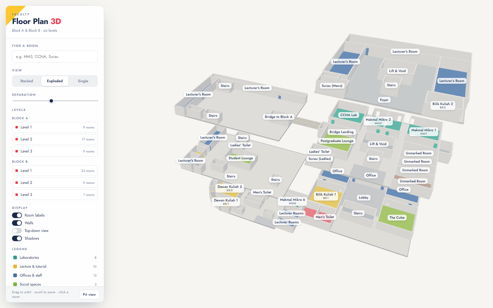
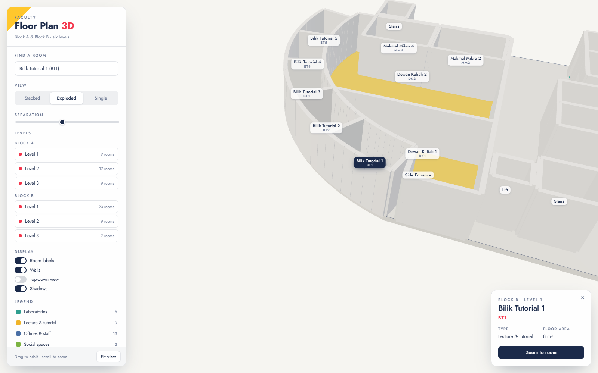
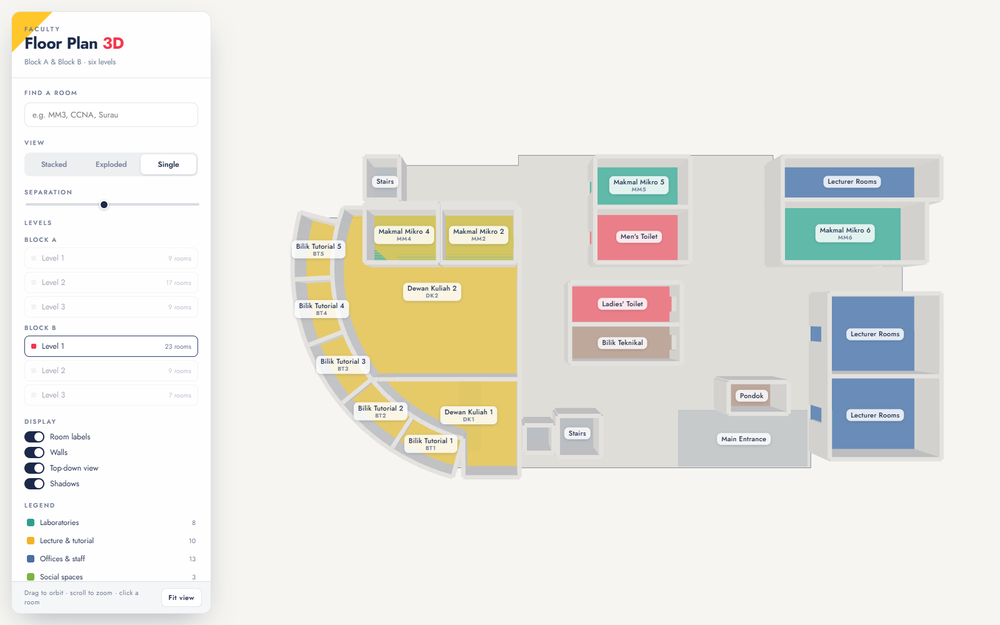

# Faculty Floor Plan · 3D

An interactive 3D model of the faculty building, reconstructed from the printed
floor plan drawings for Block A (levels 1–3) and Block B (levels 1–3).



## Running it

```bash
npm install
npm run dev      # http://localhost:5173
```

To produce a static site you can host anywhere:

```bash
npm run build    # writes to dist/
npm run preview  # serve the built output locally
```

The build uses a relative asset base, so `dist/` can be dropped into any
sub-path (GitHub Pages, GitLab Pages, an S3 bucket, a shared drive).

## What you can do

- **Stacked / Exploded / Single** view modes. Exploded pulls the floors apart so
  you can see every level at once; the separation slider controls the gap.
- **Level list** toggles individual floors in stacked and exploded modes, or
  picks the visible floor in single mode.
- **Top-down view** locks the camera overhead with north at the top, which
  reproduces the original drawings.
- **Click any room** for its block, level, type and floor area. Double-click, or
  press *Zoom to room*, to fly the camera in.
- **Search** by room name or code (`MM2`, `BT1`, `CCNA`, `Surau`). Picking a
  result reveals the room, switching view mode if it would otherwise be buried
  under the floors above.
- **Legend** entries toggle whole room categories on and off.
- Keyboard: `F` fits the view, `Esc` clears the selection.





## How the model is put together

`src/data/floorplans.js` is the only file you need to touch to change the
building. Each level is an outline polygon plus a list of rooms:

```js
{
  name: 'Makmal Mikro 2',
  code: 'MM2',
  poly: rect(350, 262, 452, 500),
  doors: [[0, 0.28], [2, 0.28]],
}
```

- **Coordinates** are in *plan units*, read straight off the source drawings.
  One unit is 1/24 m (`PLAN_SCALE`), so the numbers stay comparable to the
  originals while the scene renders in metres.
- **`poly`** is any closed contour. `rect()`, `wedge()` and `arcPts()` helpers
  cover the straight rooms and the curved tutorial-room wing in Block B.
- **`doors`** are `[edgeIndex, positionAlongEdge, width?]`. Edges are numbered
  in the order the polygon points are listed; for a `rect()` that is top,
  right, bottom, left. Each entry punches an opening and leaves a lintel above.
- **`open: true`** marks unenclosed areas (lobbies, foyers, entrances) — these
  get a tinted floor zone but no walls.
- **`labelAt`** overrides where the room label sits, for shapes whose centroid
  lands somewhere unhelpful.
- **Category and colour** are inferred from the room name by `classify()`, and
  can be overridden per room with `category`.

Walls are centred on polygon edges, so two rooms sharing an edge share one wall
rather than producing two parallel slivers.

### Relative heights of the two blocks

Block A level 2 connects to Block B level 3 via the bridge shown on both
drawings. Block B therefore sits one storey lower than Block A
(`baseElevation: -FLOOR_HEIGHT`), and the exploded view ranks floors by real
elevation so the two ends of the bridge stay joined however far the levels are
pulled apart.

## Known approximations

The source material is a set of schematic drawings, not survey data, so:

- Curved geometry in Block B is fitted to an arc centred at `(400, 300)` with
  radii of 245 and 300 plan units — close to the drawing but not exact.
- Doors are placed where the drawings show them, but their widths are uniform.
- Four rooms on Block A level 2 (east side) are drawn but unnamed on the
  original, and appear as *Unmarked Room*.
- The Block B drawings label both lecture theatres `DK1`; they are recorded here
  as `DK1` and `DK2`.
- Stair flights, lifts and voids are modelled as solid volumes rather than
  actual treads and shafts.

## Project layout

```
index.html                 page shell and control panel markup
src/main.js                scene setup, camera, interaction, UI wiring
src/styles.css             all styling
src/data/floorplans.js     the traced floor plan data — edit this
src/lib/geometry.js        2D contours to 3D slabs, walls and door openings
src/lib/build.js           assembles levels, rooms, labels and the bridge
```

Built with [three.js](https://threejs.org) and [Vite](https://vite.dev).
